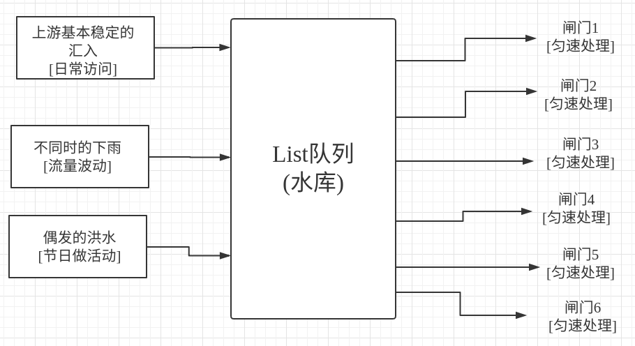

# Redis-Study
Redis Study


``` 
make && make PREFIX=/opt/redis install
```
> redis.conf
``` 
daemonize yes  #守护进程方式启动
/opt/app/redis/bin/redis-server /etc/redis-6379.conf

/opt/app/redis/bin/redis-cli -p 6379 shutdown
启动多个redus记得改pid

bind 127.0.0.1 192.168.12.13 
```

>php connect
``` 
https://pecl.php.net/package/redis
/www/server/php7/bin/phpize
./configure --with-php-config=/www/server/php7/bin/php-config
make && make install
php.ini
extension=redis.so

$redis = new Redis();
$redis->connect('127.0.0.1',6379);
//注意 防火墙 与IP绑定
```
### key-value型数据
| 命令 | 语法 |
| ------ | ------ |
| set | $redis->set('age',20) |
| get | $age = $redis->get('age') |
| del | $redis->del('age') |
| exists | $isAgeExist = $redis->exists('age') |
| setnx | $res = $redis->setnx('age',20) |
| 键名一般按照模块重大到小设计,以冒号分割,如libdata:citylist:1 |
| 举例:PV量统计|
exists是否存在
setnx if 键不存在则设置

>注释:
get 不存在的值返回false exists不存在的值返回0存在返回1  setnx 设置不存在成功返回1失败返回0 php返回true or false

>命名规范
``` 
$redis->set('user:age:1',20);
$redis->set('user:age:2',20);
$redis->set('user:age:3',20);
//user:userinfo:1
//libdata:citylist:1
//libdata:pv
```

``` 
$pvKey = 'libdata:pv';
if (!$redis->exists($pvKey)){
    $redis->set($pvKey,1);
}
$redis->incrBy($pvKey,1); #自增
```
### hash 型数据
| 命令 | 语法 |
| ------ | ------ |
| hset | $redis->hSet('dollarkiller',age',20) |
| hget | $age = $redis->hGet('dollarkiller','age') |
| hdel | $redis->hDel('dollarkiller','age') |
| hexists | $isAgeExist = $redis->hExists('dollarkiller','age') |
| hsetnx | $res = $redis->hSetnx('dollarkiller','age',20) |
| 缓存独立与数据库之外,并不是所有数据都要接受延迟 要时刻注意数据的一致性 |
| 举例:用户信息在redis中读写|
``` 
//$db = mysqli_connect()
//$db->query("UPDATE `user` SET `age`=21 WHERE `id`=1")
$redis->hset('user:a','age',21);
用户更改的数据库,更新缓存
```

### list 型数据 有序集合
| 命令 | 语法 |
| ------ | ------ |
| lset | $redis->lSet('list',1下标,4) |
| llen 返回长度| $len = $redis->lLet('list') |
| lrange 切片得到数据不更改数据 | $arr = $redis->lRange('testList',0从下标0,3拉取到下标3) |
| ltrim 保留剪切内容删除为选中内容 | $redis->lTrim('testlist',0从下标0,3拉取到下标3) |
| lpush头插入,rpush尾插入 | $redis->rPush('testList',1) |
| lpop,rpop | $res = $redis->lPop('testlist') |
| 举例:操作日志的记录与读取|
``` 
$redis->rPush($key,'管理员1登录');
$redis->rPush($key,'删除账号1');
$redis->rPush($key,'修改账号2');
$redis->rPush($key,'管理员1登出');
```

### set 型数据  无序集合
| 命令 | 语法 |
| ------ | ------ |
| sadd 添加| $redis->sAdd('testset','a) |
| smembers 返回数组中所有成员| $arr = $redis->sMembers('testset') |
| scard 返回集合的成员数量| $count = $redis->sCard('testset') |
| spop 随机删| $rand = $redis->sPop('testset') |
| sdiff 求两个集合的差集| $arr = $redis->sDiff('testset','testset2') |

### redis 缓存优化
批量写入
``` 
//        $redis->hSet($key,'tid',$tid);
//        $redis->hSet($key,'name',$name);
//        $redis->hSet($key,'count',$count);
        $redis->hMSet($key,[
            'tid'=>$tid,
            'name'=>$name,
            'count'=>$count
        ]);
```
### 消息队列
- 消息队列是消息的顺序集合
- 常用场景
    - 1 应对流量峰值
    - 2 异步处理(不定速的插入,生产和匀数的处理,消费)
    - 3 解耦应用(不同的来源的生产和不同去向的消费) 
- redis实现消息队列方式:
    - 1 基于list
    - 2 基于publish/subscribe 实现解耦
    
        
``` 
#redis list方式实现
include_once './GetRedis.php';
$redis = GetRedis::getInstance();
$redis->select(0);
$key = "list:index";
$redis->rPush($key,1);
=================================
include_once './GetRedis.php';
$redis = GetRedis::getInstance();
$redis->select(0);
$key = "list:index";
while (true)
{
    if (false !==$redis->lPop($key)){
        $redis->incrBy("pv:index",1);
    }
}
```
#### 基于list消息队列的特点
* 与水库相识
    - 1 水库的容量决定承载能力---redis的容量决定业务承载能力
    - 2 每一滴水只能经过一个闸门---每条信息只能被一个消费者消费
* 与水库不同
    - 1 水库用于储水---一般要把消息全部消费掉
    - 2 不要用的水扔掉---处理失败的消息要做容错
### 基于publish/subscribe 订阅发布的消息队列实现
        
``` 
terminal
SUBSCRIBE C1 C2 //监听C1 C2

PUBLISH C1 MSG  //向C1发布MSG
```
``` 
include_once './GetRedis.php';
//监听者
$redis = GetRedis::getInstance();

echo 'reading C1,C2...\n';
$redis->setOption(Redis::OPT_READ_TIMEOUT,-1);
$redis->subscribe(['C1','C2'],function (Redis $instance,$channel,$msg){ //第一个是redis实例 ,第二个监听的渠道,监听到的内容
    echo "recieve message from {$channel}:{$msg}\n";
});
================================================
include_once './GetRedis.php';
//发布者
$redis = GetRedis::getInstance();

$res = $redis->publish('C1','你好');
echo "clients:{$res}\n";

$res = $redis->publish('C2','你好c2');
echo "clients:{$res}\n";

$res = $redis->publish('C1','你好c1');
echo "clients:{$res}\n";

$res = $redis->publish('C3','你好c3');
echo "clients:{$res}\n";
```
发送 监听 记录 统计
>注释:
subscribe的回调函数中只能执行(订阅,取消订阅,模式订阅,模式取消订阅)
记录中 新实例化一个redis再操作
